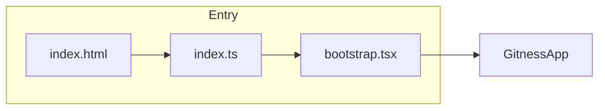
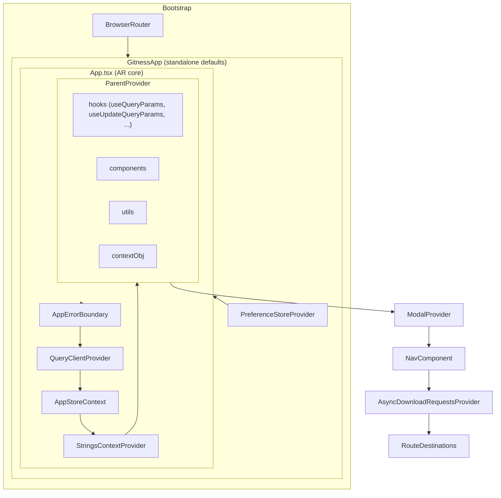
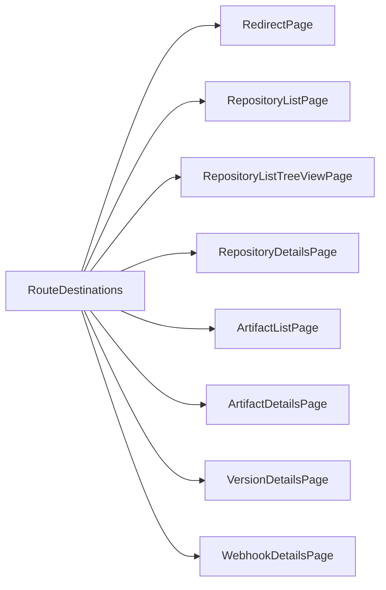
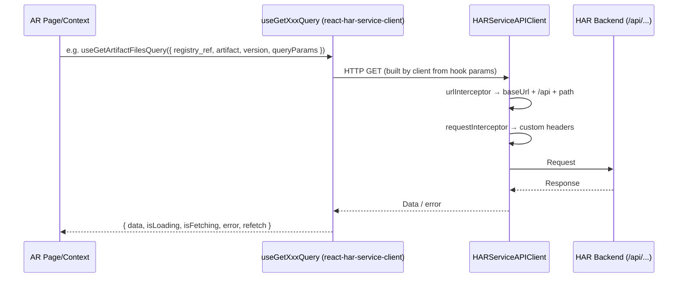

# Artifact Registry (AR) – Module Overview

This document describes the **AR (Artifact Registry)** frontend module in the Gitness repo: entrypoints, routing, APIs, hooks, and how it fits into the app.

---

## 1. Entrypoint and Bootstrap



| File | Purpose |
|------|--------|
| **`web/src/ar/index.html`** | HTML shell; mounts the app into `#react-root`. |
| **`web/src/ar/index.ts`** | **Main entry.** Loads global styles (`@ar/styles/index.scss`, `uicore.scss`) and dynamically imports **`@ar/bootstrap`**. |
| **`web/src/ar/bootstrap.tsx`** | Renders the app: `BrowserRouter` → **`GitnessApp`** with `NavComponent={RouteWithSideNav}`, `scope={{ space: 'artifact-registry' }}`, `parent={Parent.Enterprise}`. |

When AR runs **standalone** (e.g. dev), `bootstrap.tsx` is the first component that runs. When AR is loaded as a **Micro Frontend (MFE)** inside another app, the parent provides its own wrapper and passes props into `App.tsx` (see MFE section below).

---

## 2. Application Tree (High-Level)



- **GitnessApp**: Supplies default mocks (hooks, components, utils) when AR runs standalone.
- **App**: Sets up React Query, app store, strings, and **ParentProvider** (hooks/components/utils/context from parent or mocks).
- **RouteDestinations**: Renders the actual AR routes and lazy-loaded page components.

---

## 3. Routes and Where Requests Go

### 3.1 Route Definitions

Routes are built from **`web/src/ar/routes/RouteDefinitions.ts`** and **`web/src/ar/routes/utils.ts`** (e.g. `normalizePath`, `routeDefinitionWithMode`). The **base path** and **match path** come from **AppStore** (set by parent or bootstrap).

| Route helper | Path pattern (relative to AR base) | Purpose |
|--------------|-------------------------------------|--------|
| `toAR()` | `/` | AR root → redirects to repositories |
| `toARRedirect()` | `/redirect` | Redirect page (e.g. deep links with query params) |
| `toARRepositories()` | `/registries` | Repository list (list or tree by view type) |
| `toARRepositoryDetails()` | `/registries/:repositoryIdentifier` | Repository details |
| `toARRepositoryDetailsTab()` | `/registries/:repositoryIdentifier/:tab` | Repository tab (e.g. artifacts, labels) |
| `toARArtifacts()` | `/artifacts` | Artifact list (flat) |
| `toARArtifactDetails()` | `/registries/.../artifactType/artifactIdentifier` | Artifact details |
| `toARVersionDetails()` | `.../versions/:versionIdentifier` | Version details |
| `toARVersionDetailsTab()` | `.../versions/:versionIdentifier/.../:versionTab` | Version tab (overview, files, etc.) |
| `toARRepositoryWebhookDetails()` | `/registries/.../webhooks/:webhookIdentifier` | Webhook details |

**`useRoutes(true)`** (used in `RouteDestinations`) returns these helpers with paths **prefixed by `matchPath`** so they work under the parent’s URL.

### 3.2 Route → Page Mapping



- **Repository list**: `RepositoryListPage` (list) or `RepositoryListTreeViewPage` (tree), depending on `repositoryListViewType`.
- **Version details**: Rendered for separate version-details routes (Enterprise or directory view); otherwise version is shown inside **ArtifactDetailsPage**).
- **RouteProvider**: Wraps each route; handles public vs non-public (e.g. `PageNotPublic`), and wraps children in `ModalProvider`.

---

## 4. Where APIs Are Defined and How Requests Are Sent

### 4.1 API Clients (External Packages)

AR does **not** define HTTP endpoints in this repo. It uses **auto-generated API clients** from Harness packages:

| Package | Purpose |
|--------|--------|
| **`@harnessio/react-har-service-client`** (e.g. 0.36.0) | **HAR (Artifact Registry) backend.** Hooks like `useGetRegistryQuery`, `useGetArtifactFilesQuery`, `useGetArtifactVersionSummaryQuery`, etc. Types: `ListFileDetail`, `VersionMetadata`, `ArtifactVersionSummary`, etc. |
| **`@harnessio/react-ssca-manager-client`** | SSCA (software supply chain) – used where SSCA features are integrated. |
| **`@harnessio/react-ng-manager-client`** | NG Manager (account/org/project, permissions, etc.) when running in Enterprise. |

So: **“Where are the APIs defined?”** → In the **Harness backend specs**; the **react-*-client** packages are generated from those specs and expose **React Query hooks** (e.g. `useGetXxxQuery`, `useCreateXxxMutation`).

### 4.2 How the Client Is Configured (Where the Request Goes)

**`web/src/ar/app/useOpenApiClient.ts`** runs inside **App.tsx** and configures the API clients:

1. **HARServiceAPIClient**  
   - Uses **`customUtils.getApiBaseUrl('')`** (from parent or `__mocks__/utils/getApiBaseUrl`) and a **urlInterceptor** that rewrites URLs to `${apiPrefix}/api${url}`.  
   - So HAR requests go to the **same origin (or configured base) + `/api`** (e.g. `/api/v1/...` or similar, depending on backend).

2. **Request/response**  
   - **Request**: custom headers from `customUtils.getCustomHeaders()` (e.g. auth); `Authorization` is cleared and re-added by the parent.  
   - **Response**: on **401**, `on401()` is called (e.g. redirect to login).

3. **SSCAManagerAPIClient**  
   - Base URL: `window.getApiBaseUrl('/ssca-manager${url}')` → **ssca-manager** backend.

4. **NGManagerServiceAPIClient**  
   - Base URL: `window.getApiBaseUrl(url)` → **NG Manager** backend.

So: **“Where is the request sent?”** → To the **base URL** provided by the parent (or mock) and then **path** from the client package (e.g. HAR under `/api...`). No API route definitions live in the AR `routes/` folder; that folder is for **frontend routes** only.

### 4.3 Request Flow (Conceptual)



- **Pages/contexts** (e.g. `VersionFilesProvider`, `RepositoryProvider`) call hooks from **`@harnessio/react-har-service-client`** (and occasionally other clients).
- The **client** builds the URL and sends the request; **useOpenApiClient** only configures base URL and interceptors. **TanStack Query** (React Query) is used via **`queryClient`** from **`web/src/ar/utils/queryClient.ts`** and **QueryClientProvider** in **App.tsx**.

---

## 5. Hooks

### 5.1 AR Hooks (`web/src/ar/hooks/`)

| Hook | Purpose |
|------|--------|
| **`useAppStore`** | Reads/writes AR app store (baseUrl, matchPath, scope, parent, repositoryListViewType, featureFlags, etc.). |
| **`useRoutes(isRouteDestinationRendering)`** | Returns route helpers (toAR, toARRepositoryDetails, …) with paths prefixed by base/match path; uses `routeDefinitions` and optional parent `getRouteDefinitions`. |
| **`useParentHooks`** | Access to **ParentProvider** hooks (useQueryParams, useUpdateQueryParams, useQueryParamsOptions, usePreferenceStore, useModalHook, useConfirmationDialog, useDefaultPaginationProps, etc.). |
| **`useParentComponents`** | Access to parent/mock components (RbacButton, NGBreadcrumbs, ModalProvider, PageNotPublic, etc.). |
| **`useParentUtils`** | Access to parent utils (getCustomHeaders, getApiBaseUrl, getRouteDefinitions, etc.). |
| **`useParentContextObj`** | Access to parent contexts (appStoreContext, permissionsContext, licenseStoreProvider). |
| **`useDecodedParams<T>`** | Typed **route params** from `react-router-dom`’s `useParams()`. |
| **`useGetSpaceRef(repoKey?)`** | Builds HAR “space ref” from scope.space and optional repo (used in HAR API calls as `registry_ref`). |
| **`useGetRepositoryListViewType`** | Repository list view (list vs directory) from preference store. |
| **`useFeatureFlag` / `useFeatureFlags`** | Feature flags from app store (e.g. HAR_CUSTOM_METADATA_ENABLED). |
| **`useV2Apis`** | Whether to use v2 APIs (e.g. Enterprise + HAR_CUSTOM_METADATA_ENABLED). |
| **`useLicenseStore`** | License info from parent context. |
| **`useLocalStorage`** | Simple localStorage get/set. |
| **`useDeepCompareEffect` / `useDeepCompareMemo`** | Effect/memo with deep dependency comparison. |
| **`useDebouncedValue`** | Debounced value for inputs. |
| **`useConfirmationDialog`** | Re-export from `__mocks__` for compatibility. |
| **`useGetOCIVersionType`** | OCI version type for Docker/OCI flows. |
| **`useGetVersionDisplayName`** | Display name for a version. |
| **`useGetDownloadFileURL`** | URL for downloading a file. |
| **`useBulkDownloadFile`** | Bulk file download. |
| **`useAllowSoftDelete`** | Whether soft delete is allowed (e.g. feature flag). |
| **`useGetUpstreamRepositoryPackageTypes`** | Package types for upstream repo. |
| **`useGetPageScope`** | Page scope (e.g. account/org/project). |
| **`useGetSelectItems`** | Select options for dropdowns. |

### 5.2 Mock / Injected Hooks (`web/src/ar/__mocks__/hooks/`)

These are **injected via ParentProvider** (from GitnessApp when standalone, or from the host in MFE). App.tsx **overrides** some with AR-specific implementations (e.g. query params):

| Hook | Purpose |
|------|--------|
| **`useQueryParams`** | Read current URL query params (with options and optional decoder). **AR override** in App.tsx preserves raw `searchTerm` (e.g. leading zeros). |
| **`useQueryParamsOptions`** | Build options for useQueryParams (default params, decoder, processQueryParams). |
| **`useUpdateQueryParams`** | Update URL query params (e.g. pagination, search, tab). |
| **`useDefaultPaginationProps`** | Pagination props for tables (pageIndex, pageSize, gotoPage, etc.). |
| **`usePreferenceStore`** | User preferences (e.g. list view type, sort). |
| **`useModalHook`** | Open/close modals. |
| **`useConfirmationDialog`** | Show confirmation dialogs. |
| **`useGovernanceMetaDataModal`** | Governance metadata modal (Enterprise). |

---

## 6. Contexts

| Context | Purpose |
|--------|--------|
| **AppStoreContext** | AR app state: baseUrl, matchPath, scope, parent, repositoryListViewType, featureFlags, isPublicAccessEnabledOnResources, isCurrentSessionPublic. |
| **ParentProviderContext** | Hooks, components, utils, and parent context objects passed from host or GitnessApp. |
| **StringsContextProvider** | i18n strings (e.g. from `@ar/strings/strings.en.yaml`). |
| **VersionFilesContext** (VersionFilesProvider) | Data and actions for the “Files” tab on version details: file list, loading, error, refetch, updateQueryParams, queryParams, sort. |
| **VersionProvider** | Version-level data (e.g. artifact version summary) for version details page. |
| **RepositoryProvider** | Repository/registry data for repository details. |
| **AsyncDownloadRequestsProvider** | Tracks in-progress download requests. |
| **PreferenceStoreProvider** (in GitnessApp) | User preference store (list view, etc.). |

---

## 7. Pages (High-Level)

| Area | Purpose |
|------|--------|
| **redirect-page** | Redirect with query params (e.g. packageType, registryId, artifactId, versionId). |
| **repository-list** | List or tree of registries/repositories. |
| **repository-details** | Single repository: tabs (artifacts, labels, webhooks, settings, etc.). |
| **artifact-list** | Flat list of artifacts (when not in repository-details). |
| **artifact-details** | Single artifact: versions list, properties, etc. |
| **version-details** | Single version: header + tabs (overview, files, readme, dependencies, etc.). Version type (Docker, Helm, NPM, …) is resolved by **VersionFactory** and **version-details/*Version/** (e.g. DockerVersion, NpmVersion). |
| **version-list** | Version list table (used inside artifact-details). |
| **manage-registries** | Manage registries (tabs). |
| **webhook-details** | Webhook configuration. |
| **webhook-list** / **webhook-execution-list** | Webhook lists. |
| **labels-list** | Labels. |
| **digest-list** | Digests (e.g. Docker). |
| **upstream-proxy-details** | Upstream proxy configuration. |

---

## 8. MFE Integration (Parent ↔ AR)

When AR runs inside another app (e.g. Harness NG):

1. The **host** renders AR’s **App** (or a wrapper) and passes **MFEAppProps**: `renderUrl`, `matchPath`, `scope`, `customScope`, `parentContextObj`, `hooks`, `customHooks`, `customComponents`, `customUtils`, `on401`, etc.
2. **App.tsx** stores `matchPath`/`baseUrl`/`scope` in **AppStoreContext** and passes **hooks/components/utils** into **ParentProvider**.
3. **App.tsx** can **override** hooks for AR-specific behavior (e.g. `useQueryParams` / `useUpdateQueryParams` from `@ar/__mocks__/hooks` so that `searchTerm` stays raw in URL).
4. **useOpenApiClient** uses **customUtils.getApiBaseUrl()** and **getCustomHeaders()** so all API requests use the host’s base URL and auth.
5. **useRoutes()** can use **customUtils.getRouteDefinitions()** so links stay within the host’s route structure.

So: **entrypoint** when embedded is still **App.tsx**; **bootstrap.tsx** is only used when AR is run standalone (e.g. dev with GitnessApp).

---

## 9. Diagrams Summary

### 9.1 Bootstrap → Routes

```
index.ts → bootstrap.tsx → GitnessApp → App → ParentProvider → NavComponent → RouteDestinations
                                                                                    ↓
                                    RedirectPage | RepositoryListPage | RepositoryDetailsPage | ArtifactListPage | ArtifactDetailsPage | VersionDetailsPage | WebhookDetailsPage
```

### 9.2 Data Flow (Example: Version Files Tab)

```
Route: .../versions/:versionIdentifier/artifact_details?detailsTab=files
  → VersionDetailsPage
    → VersionProvider (useGetArtifactVersionSummaryQuery, path params)
      → VersionDetails (header + tabs)
        → VersionFilesProvider (useGetArtifactFilesQuery with registry_ref from useGetSpaceRef, search_term from useQueryParams)
          → ArtifactFilesContent (search bar + table; reads VersionFilesContext for data, loading, error, updateQueryParams)
```

### 9.3 Where Things Live

| What | Where |
|------|--------|
| **Main entry (standalone)** | `index.ts` → `bootstrap.tsx` → `GitnessApp` |
| **AR root component** | `App.tsx` |
| **Route definitions** | `routes/RouteDefinitions.ts`, `routes/utils.ts` |
| **Route → component mapping** | `routes/RouteDestinations.tsx` |
| **API calls** | Via `@harnessio/react-har-service-client` (and ssca/ng-manager) hooks; no API route files in AR |
| **API client config** | `app/useOpenApiClient.ts` (base URL, interceptors, 401) |
| **AR-specific hooks** | `hooks/*.ts` |
| **Query params / modals / pagination** | Injected via ParentProvider from `__mocks__/hooks` or host |
| **React Query** | `utils/queryClient.ts`; provider in `App.tsx` |

This README and the graphs give a from-scratch view of the AR module: entrypoint, app tree, routes, where APIs and hooks are defined, and how requests flow from the UI to the backend.
